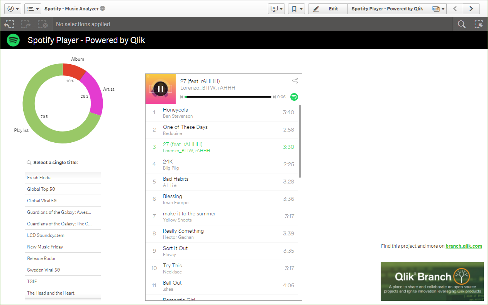

# QlikSense-Extension-Spotify
Bring the Spotify music player into your analytical dashboard with Qlik Sense. Data-driven music.

# How to install
Review the Qlik Help site for details on how to install this extension: (http://help.qlik.com/en-US/sense-developer/June2017/Subsystems/Extensions/Content/Howtos/deploy-extensions.htm)

# How to use
1. Add the extension to a Qlik Sense app, or use the included example "Spotify - Music Analyzer" qvf.
2. Provide the appropriate Spotify URI to the extension to bring in a Spotify playlist, album, artist, or song. URIs can be found in the Spotify application under the share options (https://support.spotify.com/us/using_spotify/system_settings/why-do-you-have-two-different-link-formats/) or on the web. 
3. Hit play and enjoy music while you analyze data.
